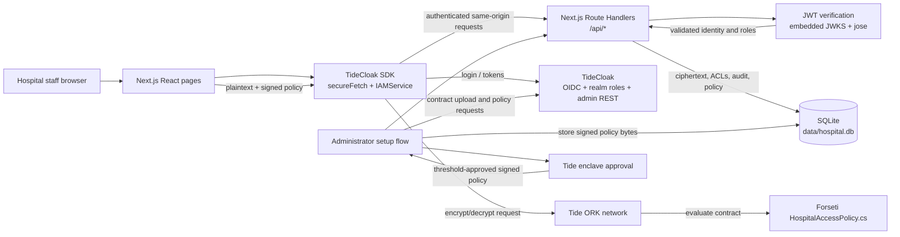

# Hospital Emergency Platform Architecture

This document describes the architecture implemented in this repository. It is based on the current Next.js application, its route handlers, the local database, and the Tide integration; it does not include features that exist only in the original specification.

## Major components

- **Next.js/React browser UI** — Pages under `src/app` provide sign-in, the dashboard, alert creation and viewing, patients, reports, audit history, and the administrator setup screen. `layout.tsx` mounts the TideCloak provider and navigation.
- **TideCloak authentication integration** — `src/app/providers.tsx` and the TideCloak SDK manage browser authentication and authenticated API requests. `/auth/redirect` completes the login callback.
- **Next.js Route Handlers** — The `/api` routes provide alert, patient, report, user, audit, configuration, and policy operations. `withAuth` in `src/lib/api-auth.ts` verifies the incoming JWT and applies server-side role checks.
- **SQLite persistence** — `src/lib/db.ts` uses `better-sqlite3` to store `data/hospital.db`. It stores ciphertext envelopes, tags, application ACLs, policy metadata, and audit entries. There is no server-side decryption path.
- **Browser crypto client** — `src/lib/use-crypto.ts` and `src/lib/crypto-client.ts` load the signed policy and call Tide's `IAMService` to encrypt and decrypt. Plaintext is created and opened in the browser; the API and database handle ciphertext.
- **Forseti access contract** — `forseti/HospitalAccessPolicy.cs` is uploaded during setup and evaluated by the ORK network. It requires `clinical-staff` to encrypt and requires the realm role named by the ciphertext tag to decrypt.

## Communication and data flow

For an alert or report, the browser encrypts the payload through `IAMService` using the signed policy and a role-derived tag such as `hosp:careteam-patient-1`. The browser sends the resulting envelope to a same-origin API route. The route verifies the caller's JWT, applies application-level ACL checks, and stores or returns the ciphertext. When a user selects **Decrypt**, the browser sends the envelope and tag to the ORK network; the Forseti contract evaluates the caller's Tide identity and role before returning plaintext. The application server never decrypts the payload.

## Where Tide/TideCloak sits

TideCloak is the identity and authorization foundation: it provides OIDC login, signed JWTs, realm roles, authenticated request support, and administrator REST endpoints used by the setup and user/policy routes. The server verifies tokens locally against the embedded adapter JWKS and checks issuer, client, expiry, and roles.

Tide's ORK network is the cryptographic enforcement layer. The signed policy and Forseti contract are passed to Tide's browser SDK; independent ORKs evaluate the contract for encryption and decryption. The SQLite application ACL decides which ciphertext rows a logged-in user may see, but it does not grant cryptographic access. The ciphertext tag and the caller's Tide role are checked by the contract.

## External services and dependencies

- **TideCloak server** — Local service at the configured auth-server URL (`http://localhost:8080` in this PoC), used for login, token exchange, realm roles, user administration, and policy/contract setup.
- **Tide ORK network** — Reached through `@tidecloak/js` and `heimdall-tide` using the Tide adapter configuration. It performs threshold-backed policy signing and policy-governed encryption/decryption.
- **Tide enclave approval** — A human approval step used by the administrator setup flow before the signed policy is stored.
- **Local SQLite database** — The only application data store; it is not a remote service.
- **Open-source runtime libraries** — Next.js/React, `@tidecloak/nextjs`, `@tidecloak/js`, `heimdall-tide`, `jose`, and `better-sqlite3` provide the implemented web, authentication, cryptographic, JWT, and persistence functionality.
